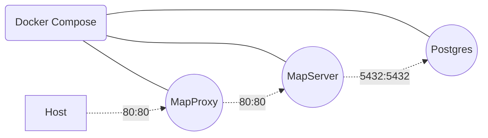
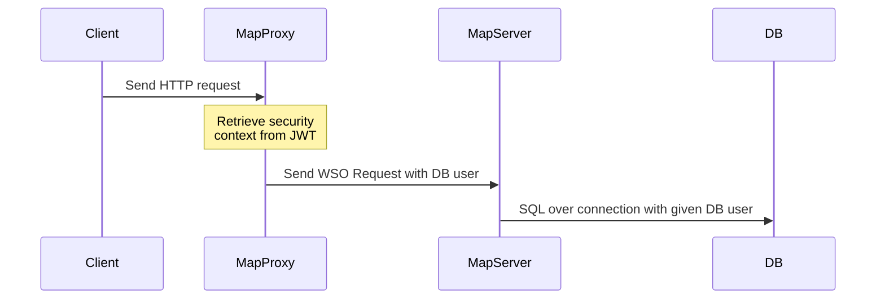

## Architecture

```mermaid
graph LR
    DC("Docker Compose")
    MP((MapProxy))
    MS((MapServer))
    DB((Postgres))
    DC --- MP
    DC --- MS
    DC --- DB
    MP -.-> |80:80| MS
    MS -.-> |5432:5432| DB
    Host -.-> |80:80| MP
```

### DataFlow

```mermaid
sequenceDiagram
    participant Client
    participant MapProxy
    participant MapServer
    participant DB
    Client ->> MapProxy: Send HTTP request
    Note over MapProxy: Retrieve security <br> context from JWT
    MapProxy ->> MapServer: Send WSO Request with DB user
    MapServer ->> DB: SQL over connection with given DB user

```
